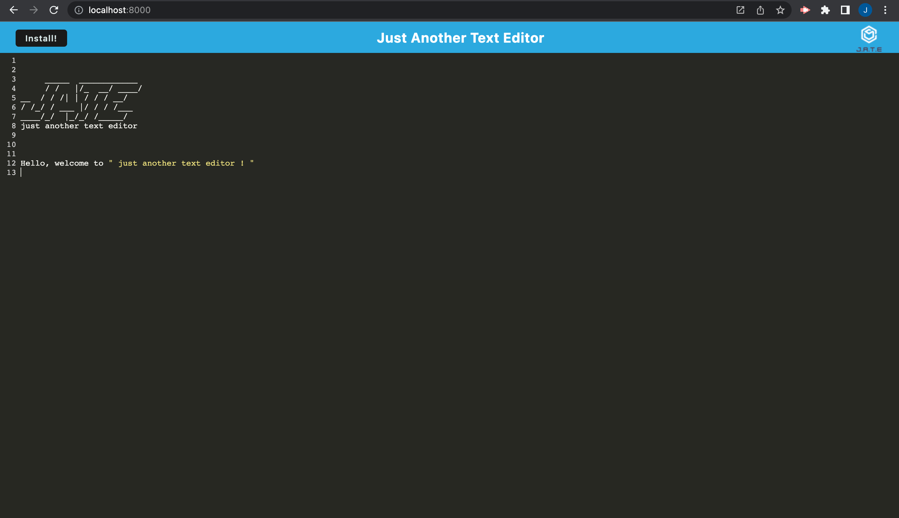
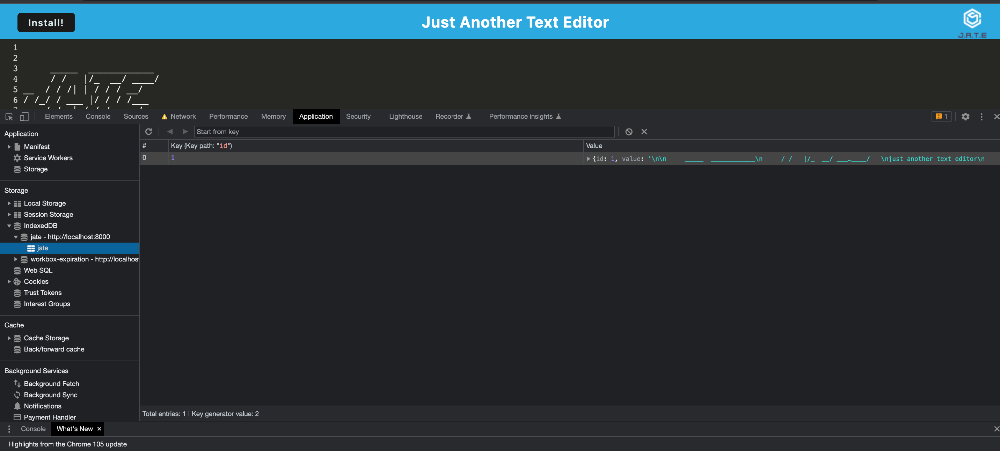

# J.A.T.E. - Just Another Text Editor

## Table of Contents

- [Description](#Description)

- [Installation](#Installation)

- [Instructions](#Instructions)

- [License](#License)

- [Contribute](#Contribute)

- [Tests](#Tests)

- [Questions](#Questions)

## Description

This application takes an existing text editor app and adds functionality for it to work as a PWA and function offline. This application is deployed through Heroku. 

The program uses: HTML, CSS, Javascript, NodeJS, ExpressJS

The repostiory is https://github.com/Justin-Morrow/text-editor and the deployed link is https://jate-auto.herokuapp.com/

## Installation

1) git clone the repo to your local machine. To use this application, run the following command to install the dependencies: npm install

2) Then run the following command:

3) npm run start

## Instructions

Type the following command in your termimal:

1) npm run start

2) Then open Insomnia and type http://localhost:8000/ to run this application on your local machine.

## License

This application is covered under the GNU GPLv3.0 License.

## Contribute

Justin Morrow

## Tests

No Tests.

## Questions

If you have questions, please contact me at the information below:

GitHub: [Justin Morrow](https://github.com/Justin-Morrow)
